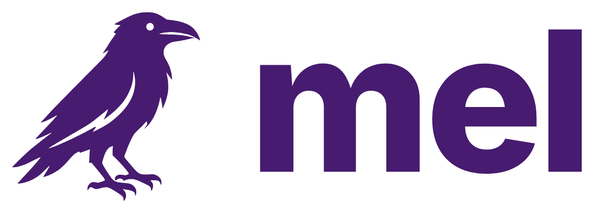
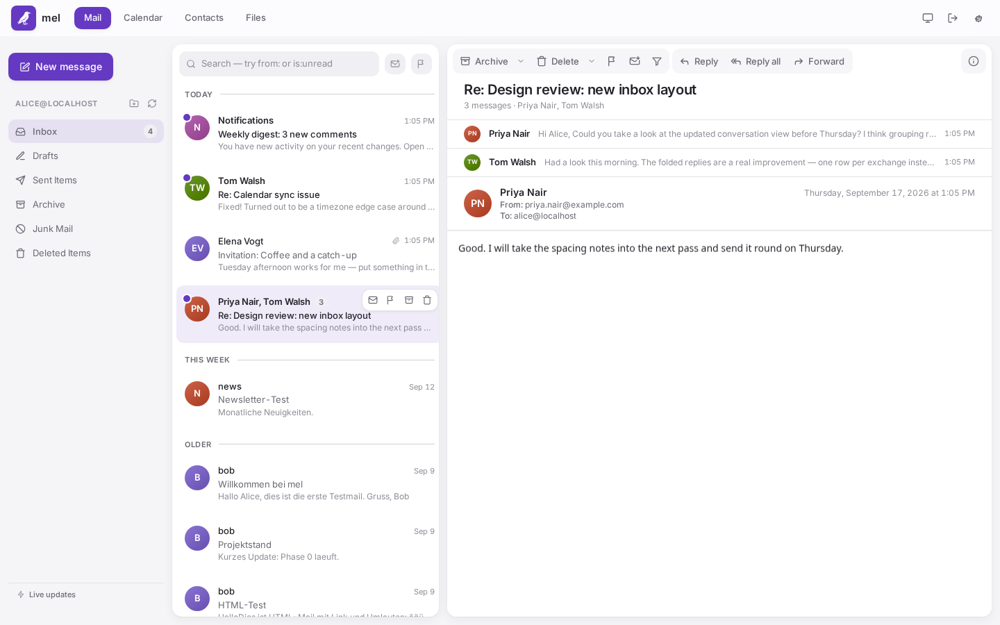
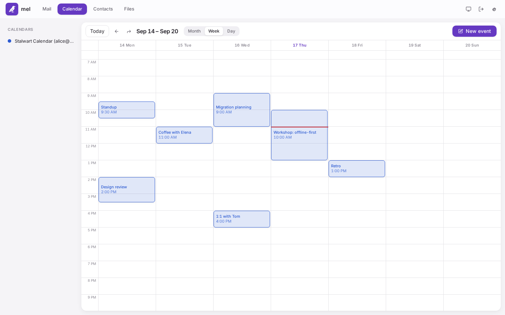
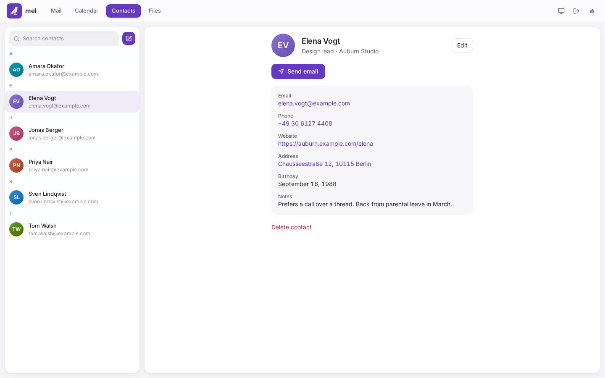
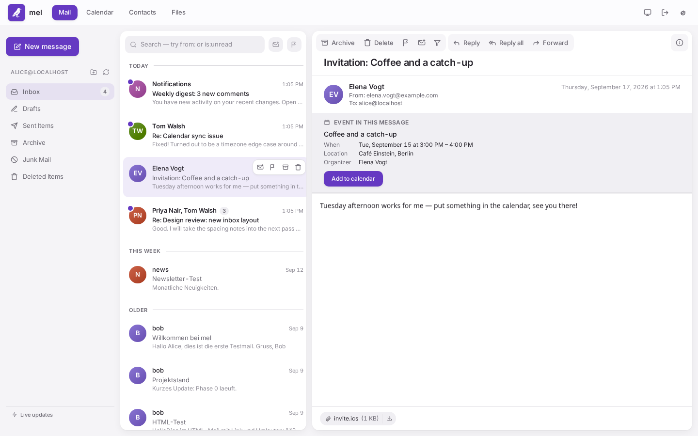
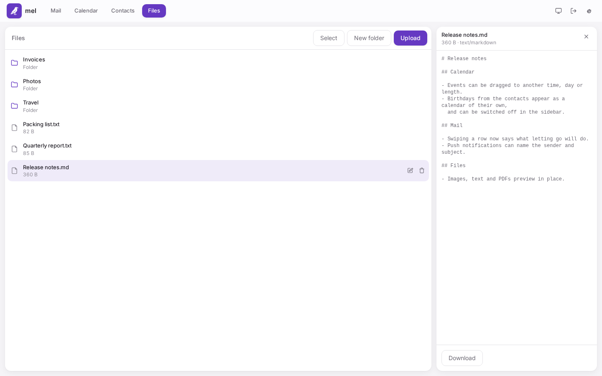
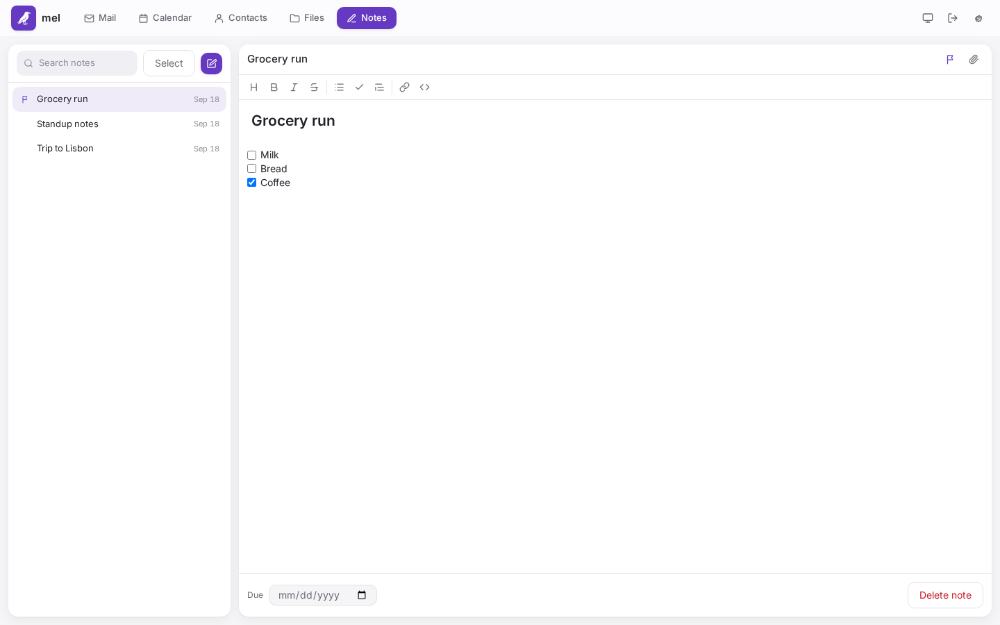

<p align="center">
  <picture>
    <source media="(prefers-color-scheme: dark)" srcset="docs/media/logo-dark.png">
    
  </picture>
</p>

<p align="center">
  <a href="https://github.com/reetzjonas/mel/actions/workflows/ci.yml"></a>
  <a href="LICENSE"></a>
</p>

A JMAP webmail client — mail, calendar, contacts, files and notes — that runs
entirely in the browser. There is no backend of its own: the app talks to your
JMAP server directly and keeps everything in IndexedDB on the device,
optionally encrypted behind a passphrase. Installable as a PWA and usable
offline.

React 19 + TypeScript + Vite, Tailwind, TanStack Router, Dexie.

<p align="center">
  <a href="docs/media/screenshot-mail-light.png">
    <picture>
      <source media="(prefers-color-scheme: dark)" srcset="docs/media/screenshot-mail-dark.png">
      
    </picture>
  </a>
</p>

## What it does

- **Mail** — delta sync, offline outbox with undo, compose with attachments and
  threading, Fastmail-style search, swipe actions, a per-sender allow list for
  remote images, keyboard shortcuts, bulk actions, folder management
- **Calendar** — month/week/day views, drag to move or resize an event,
  recurring events across DST (a single occurrence editable on its own),
  multiple calendars, birthdays as a calendar of their own, invitations and
  RSVP over iTIP
- **Contacts** — RFC 9610 contact cards with photos, birthdays and PGP public
  keys, autocomplete while composing
- **Files** — browse, upload and preview files on the server (JMAP FileNode),
  bulk move/delete, a folder or selection as one zip download
- **Notes** — a live Markdown editor, checklists and pictures included; a note
  is a plain `.md` file, readable in any other client
- **Across the board** — shift-click multi-select (Mail, Contacts, Files,
  Notes) and a shared search box (all five, Calendar's a sidebar "Upcoming"
  list); encryption at rest (Argon2id → AES-GCM), Web Push without a backend
  (RFC 9749), no third-party requests unless you ask for one

<table>
  <tr>
    <td width="50%">
      <a href="docs/media/screenshot-calendar-light.png">
        <picture>
          <source media="(prefers-color-scheme: dark)" srcset="docs/media/screenshot-calendar-dark.png">
          
        </picture>
      </a>
    </td>
    <td width="50%">
      <a href="docs/media/screenshot-contacts-light.png">
        <picture>
          <source media="(prefers-color-scheme: dark)" srcset="docs/media/screenshot-contacts-dark.png">
          
        </picture>
      </a>
    </td>
  </tr>
  <tr>
    <td width="50%">
      <a href="docs/media/screenshot-invitation-light.png">
        <picture>
          <source media="(prefers-color-scheme: dark)" srcset="docs/media/screenshot-invitation-dark.png">
          
        </picture>
      </a>
    </td>
    <td width="50%">
      <a href="docs/media/screenshot-files-light.png">
        <picture>
          <source media="(prefers-color-scheme: dark)" srcset="docs/media/screenshot-files-dark.png">
          
        </picture>
      </a>
    </td>
  </tr>
  <tr>
    <td width="50%">
      <a href="docs/media/screenshot-notes-light.png">
        <picture>
          <source media="(prefers-color-scheme: dark)" srcset="docs/media/screenshot-notes-dark.png">
          
        </picture>
      </a>
    </td>
  </tr>
</table>

## Deploying it

The app is a static bundle, so serving it is the whole job:

```sh
docker run -p 8081:8080 ghcr.io/reetzjonas/mel:latest
```

`compose.yaml` and `deploy/k8s/` hold worked examples. The image runs as a
non-root user on port 8080 and needs no writable volumes beyond scratch space
for nginx.

Two requirements are easy to miss:

1. **Serve it over HTTPS.** Service workers, notifications and Web Crypto are
   only available in a secure context.
2. **Mind the origin.** The browser calls the JMAP server straight from this
   page, so it is that server — not mel — which decides whether the call is
   allowed. Two ways to satisfy that:

   - **Different origin** (the usual case, e.g. mel on `mel.example.com`
     against `mail.example.com`): the mail server has to send CORS headers
     permitting mel's origin. Note that a different subdomain, port or scheme
     is already a different origin. Without those headers every request fails
     as an opaque `TypeError`, which JavaScript cannot tell apart from a DNS
     failure or a refused connection — so mel can only report that the server
     is unreachable, not why.
   - **Same origin**: serve mel and JMAP from one host and CORS never enters
     into it. Then the proxy in front has to route the mail server's paths —
     `/jmap`, `/.well-known/jmap`, and `/dav` if you use CalDAV — to the mail
     server *before* they reach mel, because mel's SPA fallback answers any
     unknown path with `index.html` and would otherwise shadow them:

     ```nginx
     location /jmap        { proxy_pass https://mail.example.com; }
     location /.well-known { proxy_pass https://mail.example.com; }
     ```

Signing in needs an email address and a password. mel derives the server from
the address by trying the conventional hosts (`mail.`, the apex, `jmap.`,
`imap.`); if none answer, it offers a DNS-over-HTTPS lookup of the
`_jmap._tcp` SRV record, and a field to type the server in by hand. The DNS
lookup is never performed on its own, because it discloses your mail domain to
a third-party resolver.

## Development

Use Node.js 24 (at least 24.15.0) for local development, CI and Docker builds.
CI reads `.nvmrc`; keep the Dockerfile's build image on the same version.
With nvm installed:

```sh
nvm install
nvm use
npm ci
npm run stalwart:seed   # starts and provisions a local Stalwart (Docker)
npm run dev             # app on http://localhost:5173
```

Development accounts on the local Stalwart (`http://localhost:8080`):

| Who      | Login                                                  |
| -------- | ------------------------------------------------------ |
| alice    | `alice@localhost` / `korrekt-pferd-batterie-alice`      |
| bob      | `bob@localhost` / `korrekt-pferd-batterie-bob`          |
| Admin UI | `admin@localhost` / see `docker/stalwart/.admin-pass`   |

Inject a test message:

```sh
curl "smtp://localhost:1025/seed.mel.dev" \
  --mail-from bob@localhost --mail-rcpt alice@localhost -T mail.eml
```

The EHLO name in the URL path has to contain a dot, or Stalwart answers 550.

## Tests

```sh
npm test                # Vitest (unit)
npm run test:e2e        # Playwright (desktop + mobile, expects Stalwart running)
npm run build           # vite build + tsc typecheck
```

The end-to-end suite can also be pointed at a deployed instance, which is how
CI tests the container image it is about to publish:

```sh
MEL_E2E_BASE_URL=http://localhost:8081 npm run test:e2e
```

## Resetting Stalwart

```sh
npm run stalwart:down
docker volume rm stalwart_stalwart-data
rm -rf docker/stalwart/etc docker/stalwart/.admin-pass
npm run stalwart:seed
```

Stalwart ≥ 0.16 is provisioned entirely through its JMAP management API
(capability `urn:stalwart:jmap`, objects `x:Bootstrap`, `x:Http`, `x:Account`,
…) — `docker/stalwart/seed.sh` documents the details.

## Developing against a server without CORS

```sh
MEL_PROXY_TARGET=https://mail.example.com npm run dev
```

Requests then go through `http://localhost:5173/jmap-proxy/*`. This is a
development convenience only; a deployed instance needs the real thing.

## Architecture

- `src/domain/` — provider-agnostic models (never imports from `providers/`)
- `src/providers/jmap/` — JMAP client, mappers, push; the seam where an
  IMAP or Gmail provider would slot in
- `src/sync/` — delta sync (`Foo/changes`), outbox, scheduler
- `src/storage/` — Dexie schema; every row carries its contents in a
  `plain`/`enc` envelope, so index columns stay readable while payloads can be
  encrypted
- `src/features/` — mail, calendar, contacts, files, notes and settings UI

## License

MIT — see [LICENSE](LICENSE).
